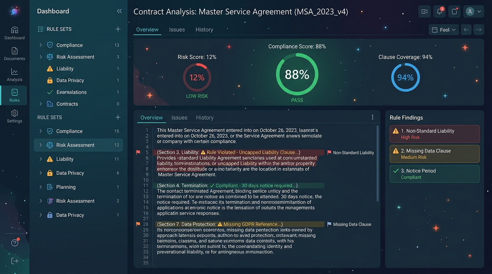
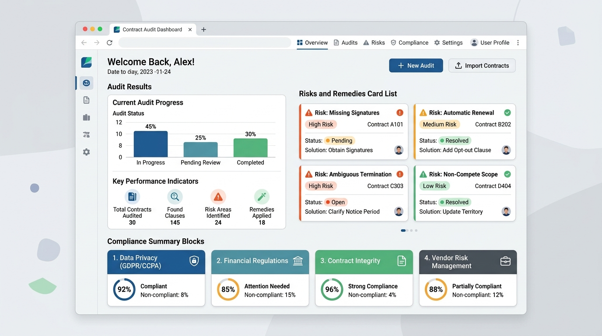

# Legalite AI ⚖️🛡️

> **CascadeFlow™ Multi-Agent Legal Audit Engine with Hindsight Memory Hub**

Legalite AI is a highly sophisticated, full-stack legal intelligence application powered by an autonomous sequence of cooperative AI agents. Designed for freelancers, contractors, and corporate teams, it parses complex documents, extracts regulatory obligations, performs high-level safety audits, and flags issues against a custom, persistent catalog of personal preferences.

---

## 📺 Demo Video Walkthrough

Watch Legalite AI in action! Below is a demo showcase showing how to log in, run the multi-agent CascadeFlow™ analyzer, customize legal preference checklists, and compare multiple contract offers:

[](https://www.youtube.com/watch?v=dQw4w9WgXcQ)
> 💡 *Note: To update this preview with your live video walkthrough, replace the placeholder links and thumbnail codes above with your custom YouTube or Loom video ID.*

### What the walkthrough covers:
1. **The Fresh Demo Engine**: One-click "Try Free Demo" with automatic sandbox provisioning, ensuring each demo session gets a completely clean slate with zero cross-user pollution.
2. **Autonomous Multi-Agent Sequence**: Watching the live visual progress bar as 6 distinct agents (Parser, Extractor, Auditor, Memory Specialist, Negotiation Advisor, and Reporter) coordinate their tasks.
3. **Interactive Workspace**: Selecting clauses, exporting ready-to-send email templates, and evaluating the safety index of contract items.
4. **Hindsight Memory Hub**: Adding personalized exclusion guidelines (such as strict payment milestones or IP ownership rules) and watching the system automatically highlight those custom compliance risks in future uploads.
5. **Interactive Theme System**: Seamlessly toggling between the slate-dark twilight appearance and the high-contrast light mode.

---

## 📷 Application Showcases

### Multi-Agent Autonomous Cascade Workflow


### Sleek Contract Audit & Risk Dashboard


---

## ✨ Core Features & Visual Pillars

1. **CascadeFlow™ Multi-Agent Workflow**:
   Six specialized autonomous agents execute sequentially to dissect contracts:
   - 🕵️ **DocumentParsingAgent**: Handles ingestion, text normalization, and PDF recovery.
   - 🔍 **ClauseExtractionAgent**: Extracts terms like Notice Periods, IP Clauses, and Compensation into a rigid schema.
   - ⚖️ **RiskAnalysisAgent**: Benchmarks extraction metrics against standard protections, mapping severity to Low, Medium, or High risk levels.
   - 🧠 **MemoryRetrievalAgent**: Cross-references findings with the **Hindsight Memory Hub** to catch personalized rule violations.
   - 📝 **RecommendationAgent**: Automatically designs polite counter-proposals and ready-to-copy email negotiation scripts.
   - 📊 **ReportGenerationAgent**: Generates a consolidated report card and assigns an algorithmic overall Contract Safety Index.

2. **Hindsight Memory Hub**:
   Enter custom guidelines like *"I do not sign contracts with multi-year non-competes"* or *"Payment must occur within 15 days of invoicing"*. The agent memory intercepts agreements to highlight violations instantly.

3. **Multi-Theme UI (Light & Dark Modes)**:
   A fully integrated responsive interface that seamlessly respects system themes and custom toggles. Transitions use micro-animations powered by `motion` and adapt flawlessly between Slate-Dark and High-Contrast Light aesthetics.

4. **Zero-Setup Local Sandbox**:
   If no Gemini API key is configured, the server switches to a high-quality contract simulator automatically, so you can test features instantly with realistic documents.

---

## 🛠️ Step-by-Step VS Code Local Setup

Follow these simple steps to run Legalite AI on your local machine using VS Code:

### 1. Prerequisites
- **Node.js**: Install Node.js (version 18 or above recommended) from [nodejs.org](https://nodejs.org/).
- **Visual Studio Code**: Ensure VS Code is installed.

### 2. Download and Extract Code
1. Export/download the project ZIP from AI Studio Build.
2. Extract the archive into a folder on your machine.

### 3. Open in VS Code
1. Launch VS Code.
2. Click **File > Open Folder...** and select the extracted project directory.

### 4. Install Dependencies
1. Open the integrated terminal in VS Code (`Ctrl + ~` on Windows/Linux or `Cmd + ~` on macOS).
2. Run the following command to download package assets:
   ```bash
   npm install
   ```

### 5. Configure Environment Variables
1. Look for `.env.example` in the root of the project.
2. Create a copy of it and rename the file to `.env` (or run `cp .env.example .env` in the terminal).
3. Open the `.env` file and add your Gemini API Key:
   ```env
   GEMINI_API_KEY=your_actual_gemini_api_key_here
   ```
   > **Note on Simulated Flow**: If you leave `GEMINI_API_KEY` empty or as the default placeholder, the console prints a message: *"GEMINI_API_KEY not configured or is placeholder. Server will use high-quality simulated agent flows."*
   > This means the applet uses static, high-fidelity contract files (like freelance agreements or internship covenants) to safely simulate the CascadeFlow multi-agent progress without crashing. Once you add your key, real-time Gemini LLM processing is automatically enabled!

### 6. Run the Dev Server
1. In the terminal, run:
   ```bash
   npm run dev
   ```
2. The server boots up. The terminal will output:
   `Legalite AI running at http://localhost:3000`
3. Click or navigate to **`http://localhost:3000`** in your browser to view the application.

---

## 🚀 How to Deploy on Vercel

Because Legalite AI uses a custom full-stack server (`server.ts`), we can set up **Vercel Serverless Functions** or standard Node.js routing.

### Step 1: Create a `vercel.json` file
Create a `vercel.json` configuration file in the project's root directory with the following contents:

```json
{
  "version": 2,
  "builds": [
    {
      "src": "api/index.ts",
      "use": "@vercel/node"
    },
    {
      "src": "package.json",
      "use": "@vercel/static-build",
      "config": {
        "distDir": "dist"
      }
    }
  ],
  "routes": [
    {
      "src": "/api/(.*)",
      "dest": "api/index.ts"
    },
    {
      "src": "/(.*)",
      "dest": "/$1"
    }
  ]
}
```

### Step 2: Create a serverless API directory
Create a new file at `api/index.ts` to export your Express app.

Example `api/index.ts`:
```ts
import express from 'express';
// Import your app setup, routes, and handlers from your existing server logic.
// Ensure you do not listen to a hardcoded port when exported for Vercel Serverless.
```

### Step 3: Deploy with Vercel CLI
1. Open your terminal and install the Vercel CLI:
   ```bash
   npm install -g vercel
   ```
2. Log in to Vercel:
   ```bash
   vercel login
   ```
3. Run the deployment command from the project root:
   ```bash
   vercel
   ```
4. Follow the setup prompts. Add your environment variables (like `GEMINI_API_KEY`) in the Vercel Dashboard for secure server-side requests.
5. For a production-ready deploy, run:
   ```bash
   vercel --prod
   ```

---

## 📂 Project Structure Map

```text
├── api/                  # Vercel Serverless Entrypoint (for production hosting)
├── server/               # Express DB managers & database handlers
├── src/
│   ├── assets/           # Visual Assets & Generated Demo Mockups
│   ├── components/       # Reusable React UI (Audits, Dashboard, Memory, Login)
│   ├── lib/              # PDF Generation utilities and formatting
│   ├── App.tsx           # Primary Single-Screen Client Frame
│   ├── main.tsx          # Client bundle setup
│   └── types.ts          # Strongly typed structures for CascadeFlow
├── server.ts             # Core Express full-stack proxy & Multi-Agent Orchestrator
├── package.json          # Node configuration & scripts
└── tsconfig.json         # TypeScript compiler rules
```

---

## 🔒 Security & Privacy Notice
All files, text, and keys are protected. Contracts analyzed via the **Gemini API** on the server are handled using private TLS protocols and are never exposed to the client browser. No persistent logs of contract contents are retained externally.
